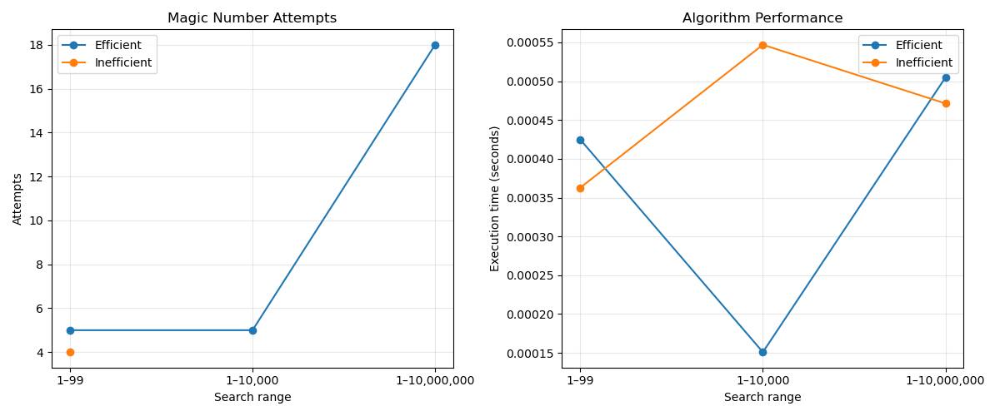

# Magic Number Guessing Algorithm
The goal of this algorithm is to procedurally guess a number from 1 to 100, 1 to 10,000 or 1 to 10,000,000 in as few steps as possible. All while being able to take in consideration feedback to eliminate as many possibilities as possible throughout the guessing sequence. The purpose of this algorithm is to practice developing a binary search algorithm and understand the logic/mathematical approach to them. The following is the attempt to translate a procedure developed from a 1 to 99 magic number scenario into python and put the logic of my proposal to the test. 

## Flowchart from Assignment #1


```python
### Magic number guessing algorithm based on initial testing and experimentation
### Will deploy Sieve of Erasthones after using quartile range calculations instead of brute force
### This was made since I can't hard code a lot of if statements for more than 100 numbers, let alone 10000

### First Stage -- Quartile Determination

import numpy as np
import random as random
import time

constraint = 0.
print("Play the magic number game! Please input your magic number and I will try to guess, all qualitative answers in lowercase please and thank you! :)")
n = int(input("What is your magic number? "))

def __quartileRange__(range, constraint):
    range = int(input("What is the range for guesses? ", ))
    constraint = 0.5*range
    whichQuartile = input("Is the number higher or lower than "f"{constraint}? """)
    if whichQuartile == "higher":
        higher_q = 0.75*range
        whichQuartile1 = input("Is the number higher or lower than "f"{higher_q}? """)

        if whichQuartile1 == "higher":
            options = [0.75*range, range]
        elif whichQuartile1 == "lower":
            options = [0.5*range,0.75*range]
        else:
            return

    elif whichQuartile == "lower":
        lower_q = 0.25*range
        whichQuartile = input("Is the number higher or lower than "f"{lower_q}? """)
        if whichQuartile == "higher":
            options = [0.25*range,0.5*range]
        elif whichQuartile == "lower":
            options = [1,0.25*range]
        else:
            return
    else:
        return

    options = [int(options[0]), int(options[1])]
    options_list = np.arange(options[0], options[1] + 1)
    if range <= 100:
        print(options_list)
    elif range > 100:
        print(options_list[0], np.max(options_list)) ## In the event that the range is really large, I only need the beginning and end
    return options_list

options = __quartileRange__(range, constraint)

### Second & third stages-- Sieve of Erasthones // finding all prime numbers in remaining solution set for decimination

p = 2
non = []

def __sieve__(p, n, non):
    maximum = int(np.max(options))
    __mask = options >= 2
    divisor = 2

    while divisor * divisor <= maximum:
        __mask &= (options % divisor != 0) | (options == divisor)
        divisor += 1

    prime_options = options[__mask | (options == n)]
    print(prime_options)
    return prime_options

        
prime_options = __sieve__(p, n, non)

### Fourth stage -- Use remaining prime number values for continued filtering // actual guessing stage

num = ""
prime = []
def __prime_filter(num, prime, constraint):
    g_count = 0
    candidates = np.array(prime, dtype=int)

    while candidates.size:
        guess_index = len(candidates) // 2
        constraint = int(candidates[guess_index])
        g_count += 1

        if n == constraint:
            print("Great! The magic number is", constraint, "and I guessed it in", g_count, "guesses!")
            return g_count
        elif n > constraint:
            candidates = candidates[guess_index + 1:]
        else:
            candidates = candidates[:guess_index]

    print("The magic number was not in the candidate list.")
    return g_count

begin = time.perf_counter()

__prime_filter(num, prime_options, constraint)

end = time.perf_counter()
print(f"Total runtime is {end - begin}")
print("Program terminated.")
```
## Inefficient multiple-of-two checker for the whole range
```python


def __multiple_filter__(upper_bound, factor):
    upper_bound = int(upper_bound)
    factor = int(factor)

    if factor <= 0:
        raise ValueError("factor must be a positive integer")

    # Test multiples of two and three together, without testing duplicates.
    multiples = np.arange(1, upper_bound + 1)
    candidates = multiples[(multiples % 2 == 0) | (multiples % 3 == 0)]
    guesses = 0

    while candidates.size:
        guess_index = len(candidates) // 2
        guess = int(candidates[guess_index])
        guesses += 1

        if guesses % 10 == 0:
            correct = input(f"Is {guess} your number? (yes/no) ").strip().lower()
            if correct == "yes":
                print("The number is", guess, "and I guessed it in", guesses, "guesses!")
                return guess

        if n == guess:
            print("The number is", guess, "and I guessed it in", guesses, "guesses!")
            return guess
        elif n < guess:
            # Continue through every candidate lower than this guess.
            candidates = candidates[:guess_index]
        else:
            # Continue through every candidate higher than this guess.
            candidates = candidates[guess_index + 1:]

    print("The magic number was not a multiple of two or three.")
    return None

multiple_of_two = __multiple_filter__(100, 2)
multiple_of_three = __multiple_filter__(100, 3)
```

## Predicted Performance

|Search Range|Magic Number|Pred. Attempts Efficient|Pred. Attempts Inefficient|Which Expected to run faster?|
|---|---:|---:|---:|---|
|1 to 99|45|6|4|Inefficient|
|1 to 10,000|4,356|14| Too many |Efficient|
|1 to 10,000,000|6,789,012|24|Too many |Efficient|


## Performance Table

|Search Range|Magic Number|Algorithm Used|Attempts |Execution Time (in seconds)|
|---|---:|---:|---:|---|
|1 to 99|45|Efficient|5|0.00042469999993954843|
|1 to 99|45|Inefficient|4|0.000362799999948038|
|1 to 10,000|4,356|Efficient|5 |0.0001509000003352412|
|1 to 10,000|4,356|Inefficient|Failed?|0.000546900000244932|
|1 to 10,000,000|6,789,012|Efficient |18|0.0005047999998168962 |
|1 to 10,000,000|6,789,012|Inefficient|Failed?|0.0004712999998446321|


## Performance Visualization
Plotted both the attempts and execution time comparisons
```python
import matplotlib.pyplot as plt

# Performance data from the table above.
search_ranges = ["1–99", "1–10,000", "1–10,000,000"]
eff_attempts = [5, 5, 18]
ineff_attempts = [4, None, None]
eff_times = [0.0004247, 0.0001509, 0.0005048]
ineff_times = [0.0003628, 0.0005469, 0.0004713]

fig, axes = plt.subplots(1, 2, figsize=(12, 5))

# Use None for failed attempts so they are not plotted as valid values.
axes[0].plot(search_ranges, eff_attempts, marker="o", label="Efficient")
axes[0].plot(search_ranges, ineff_attempts, marker="o", label="Inefficient")
axes[0].set_title("Magic Number Attempts")
axes[0].set_xlabel("Search range")
axes[0].set_ylabel("Attempts")
axes[0].legend()
axes[0].grid(True, alpha=0.3)

axes[1].plot(search_ranges, eff_times, marker="o", label="Efficient")
axes[1].plot(search_ranges, ineff_times, marker="o", label="Inefficient")
axes[1].set_title("Algorithm Performance")
axes[1].set_xlabel("Search range")
axes[1].set_ylabel("Execution time (seconds)")
axes[1].legend()
axes[1].grid(True, alpha=0.3)

plt.tight_layout()
plt.show()
```

## Performance Comparison Charts




## Analysis
```markdown
1) I had to make significant deviations and adjustments to my overall strategy to deploy an algorithm that could handle any magic number ranges greater than 100. As such I did some research and found out about the Sieve of Erasthones and went from there. Obviously, I can't hard code for every single prime number between 1 and 10,000. So I developed a function that could do it based on a formula, like a proper algorithm should.

2) I am honestly a little shocked with how well my Efficient algorithm performed. Especially with higher values. I thought it would struggle more than it did. I may need to revisit my inefficient. I think my idea is good for an algorithm that could find any values, the problem of course is some idea that I missed.

3) My Efficient algorithm reduces the number of attempts by simply separating the range of values into quartiles, discovering the global quartile range where the magic number is, then dividing that quartile based on prime number values. The prime number values, I thought, were a good way to divide your remaining options, they are fixed values at predictable places along all real numbers (sufficiently small ones anyway) and they are solid metrics to try and narrow down your options pretty quickly.

4) My Inefficient algorithm intentionally goes out of its way to NOT reduce the number of possible candidates with each guess. I think thats probably why it failed a couple of times, because I need to reduce the sheer amount of storage I am making for the inefficient algorithm. Since it absolutely maximizes storage to find possible values.

5) When the problem gets larger, the amount of necessary attempts increases as well for both of my algorithms. The execution time, however, does not, which is actually what I was aiming for with my efficient algorithm. I figured, that even if it requires 20+ steps to solve the magic number, if it can eliminate a whole lot of values, then it will save time, which leads into part 6.

6) The relationship between attempts and execution time were surprisingly inversely related between n=10,000 & n=10,000,000. Which I found... interesting. I am actually not sure why this is the case, but the amount of execution time drastically decreased for my efficient algorithm between n=100 and n=10,000, but had the opposite effect in my inefficient algorithm. Which I found very curious.

7) I believe the efficient algorithm works best when the prime number values of your possible n-values are plentiful and dense. If they are spaced out from one another, it will very likely start to struggle with the huge gaps between each prime number. For my inefficient algorithm, the closer the magic number value is to 0, the better. The larger the value the more likely it will fail. I was thinking about converting my multiples checker into more of a binary search mechanism, where multiples of 2 and 3 are checked starting from the beginning, the end, and the median of the range simultaneously. This actually could drastically improve the speed. In that case, my worst case scenario for my inefficient algorithm would be if the magic number is exactly at a quartile of the full range.

8) In the event I needed to check 1 billion possible numbers, I would probably use the efficient algoirthm first. Its going to be able to eliminate a fairly large amount of optiosn very quickly. It is designed to eliminate 75% of all possible values after the first two guesses. Thus bringing the actual guess range to 250 million, which is still alot, but I trust in the Sieve of Erasthones system. It will still take quite a lot of attempts, but its safer than the inefficient option.
```